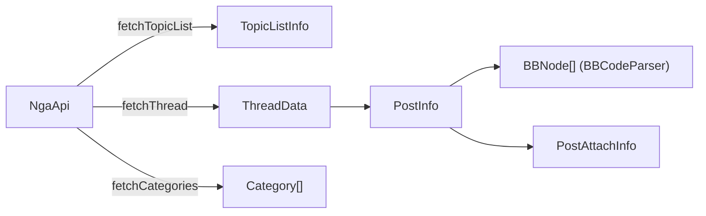
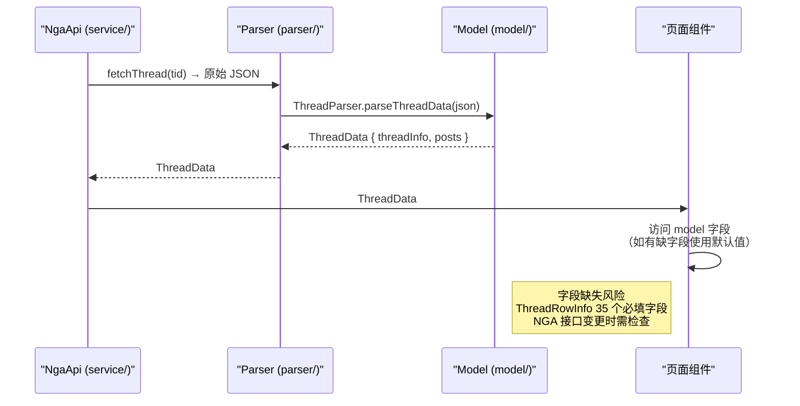

# 数据模型

## 概述

`model/` 目录包含项目中所有数据类型的定义，不包含业务逻辑。模型以 Class 和 Interface 为主，部分枚举（如 `BBNodeType`）。

## 文件列表

| 文件 | 核心导出 | 说明 |
|------|----------|------|
| `BBCodeNode.ets` | `BBNodeType(enum)`, `BBNode` | BBCode 语法树节点定义 |
| `Forum.ets` | `Category`, `BoardContent` | 论坛板块分类 |
| `Thread.ets` | `ThreadInfo`, `ThreadRowInfo`, `Attachment` | 帖子/主题信息 |
| `Post.ets` | `Post` | 楼层/回复 |
| `Topic.ets` | `TopicListInfo` | 主题列表 |
| `User.ets` | `ProfileData`, `ReputationData`, `AdminForumsData` | 用户资料 |
| `Notification.ets` | `NgaNotification` | 通知 |
| `Message.ets` | `MessageThreadInfo`, `MessageDetailInfo` | 私信 |
| `Api.ets` | `ApiResponse` | API 通用响应结构 |
| `NoteInfo.ets` | `UserNoteEntry` | 用户笔记 |
| `FilterKeyword.ets` | `FilterKeyword` | 关键词过滤 |
| `raw/NgaRawTypes.ets` | NGA 原始 JSON 类型 | 与 NGA API 直接对应的原始类型 |

## 核心模型说明

### BBCodeNode

`BBCodeNode.ets:1-59` 定义了 AST 节点结构，包含 40 种节点类型枚举和 14 个默认值字段的 `BBNode` 类：

```typescript
// BBCodeNode.ets:43-58 — 节点字段全部显式初始化默认值
class BBNode {
  type: BBNodeType = BBNodeType.TEXT
  text: string = ''
  children: BBNode[] = []
  href: string = ''
  src: string = ''
  color: string = ''
  size: number = 0
}
```

详见 [BBCode 解析与渲染](../服务层/BBCode解析与渲染.md)。

### PostInfo (在 NgaApi.ets 中定义)

虽然不是 `model/` 目录下的文件，`PostInfo` 是最核心的楼层数据模型（`service/NgaApi.ets:74-103`）：

| 字段 | 类型 | 说明 |
|------|------|------|
| `tid` | `number` | 帖子 ID |
| `pid` | `number` | 楼层 ID |
| `lou` | `number` | 楼层号 |
| `authorid` | `number` | 作者 UID |
| `author` | `string` | 作者昵称 |
| `subject` | `string` | 标题 |
| `content` | `string` | BBCode 内容 |
| `avatar` | `string` | 头像 URL |
| `attachs` | `PostAttachInfo[]` | 附件列表 |
| `signature` | `string` | 签名 |
| `isanonymous` | `boolean` | 是否匿名 |
| `isInBlackList` | `boolean` | 是否在黑名单 |
| `reputation` | `number` | 威望值 |

### Category — 板块分类

`Forum.ets:1-5` 中的板块层级模型，使用 class 定义并初始化默认值：

```typescript
// Forum.ets:1-5 — 板块分类（class 有默认值）
class Category {
  fid: number = 0         // 板块 ID
  name: string = ''       // 名称
  children: Category[] = []  // 子板块递归结构
}
```

其余 Forum 中的类型（`BoardContent`、`Board`、`SubBoard`）使用 interface 定义，字段缺失时需调用方自行防护。

### ThreadRowInfo — 最密集的模型

`Thread.ets:33-67` 定义了 35 个必填字段的接口，是项目中字段最多的模型。其中 `comments: ThreadRowInfo[]`（`Thread.ets:51`）和 `hotReplies: string[]`（`Thread.ets:52`）两个数组字段在后端返回缺失时将产生 `undefined`，需消费方做可选链处理。

### ProfileData — 防御性编程最佳实践

`User.ets:8-28` 是防御性做得最好的模型，18 个字段全部用 class 初始化默认值，尤其 `adminForums: AdminForumsData[] = []`（`User.ets:26`）和 `reputationEntryList: ReputationData[] = []`（`User.ets:27`）确保遍历不抛异常。

## 模型间关系





## 错误处理

### 字段缺失容错

项目中模型分为两种定义模式：

| 模式 | 示例文件 | 容错表现 |
|------|----------|----------|
| **class + 显式默认值** | `BBCodeNode.ets`、`User.ets`（ProfileData）、`FilterKeyword.ets` | 字段缺失时使用默认值（`0`/`''`/`[]`） |
| **interface 无默认值** | `Forum.ets`、`Thread.ets`、`Topic.ets`、`Message.ets`、`Notification.ets` | 字段缺失时为 `undefined`，需调用方自行判断 |

**高风险接口**（未使用 class、字段多、后端返回不稳定的场景）：

1. **`ThreadRowInfo`**（`Thread.ets:33-67`）— 35 个必填字段，NGA 接口在特定场景下可能缺失 `anonystatus`、`alterinfo` 等字段
2. **`Forum.ets`** 中的各接口 — 除 `BoardContent.bit?` 外全部必填
3. **`NotificationInfo`** 及其派生接口 — `unread: boolean` 等字段在后端可能不存在

### 解析器层的兜底

API 返回的原始 JSON 通过 `parser/` 解析器转换时，解析器负责填充缺失字段的默认值（`parseThreadData` 等）。消费方（页面组件）应优先使用解析后数据而非直接操作原始 JSON。

### 数组字段空值防护

数组字段（`children`、`attachs`、`comments`、`hotReplies` 等）如果定义为 `interface` 中的 `Type[]` 而非 class 中初始化的 `= []`，在 NGA 接口返回缺失时将产生 `undefined`，调用 `.map()`/`.forEach()` 会抛出 `TypeError`。消费方需做可选链处理（`arr?.map()`）。

### 匿名用户处理

`authorid = 0` 或 `isanonymous = true` 时，用户头像和信息不可点击。`User.ets` 的 `ProfileData` 中 `uid: string = ''` 默认值为空字符串，匿名场景下不会产生伪造的交互。

## 边缘情况

1. **缺失字段**：NGA 接口可能返回缺少某些字段的 JSON，模型构造函数需设置合理默认值
2. **匿名用户**：`authorid = 0` 或 `isanonymous = true` 时，用户信息不可点击
3. **威望为负**：`reputation` 字段可能为负数时，显示时需处理符号
4. **巨量附件**：一个楼层可能包含数十个附件，`attachs` 数组需考虑懒加载

## 常见问题

**Q: 模型字段与 API 返回字段不一致怎么办？**
A: 解析器（`parser/`）负责从 API 原始数据映射到模型字段。如果 API 变更，只需修改对应解析器，不涉及消费方代码。

**Q: 为什么 `PostInfo` 定义在 `service/NgaApi.ets` 而非 `model/` 目录下？**
A: `PostInfo` 与 `NgaApi` 的返回类型定义耦合紧密（同时作为 API 返回体和页面渲染的输入），放在同一文件中避免跨模块的循环 import。

**Q: 模型字段的类型安全如何保证？**
A: 所有字段在 Class 定义中显式初始化（`number = 0`、`string = ''`、`boolean = false`），JSON 解析时类型不匹配的字段使用默认值，不会抛出异常。
