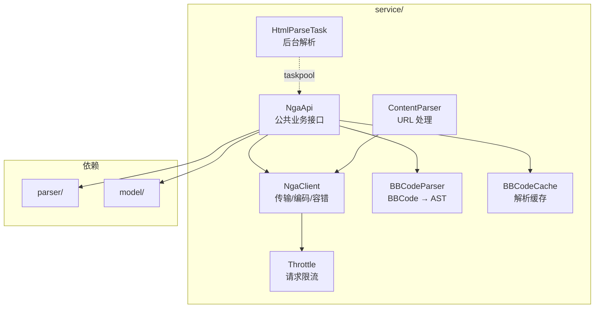
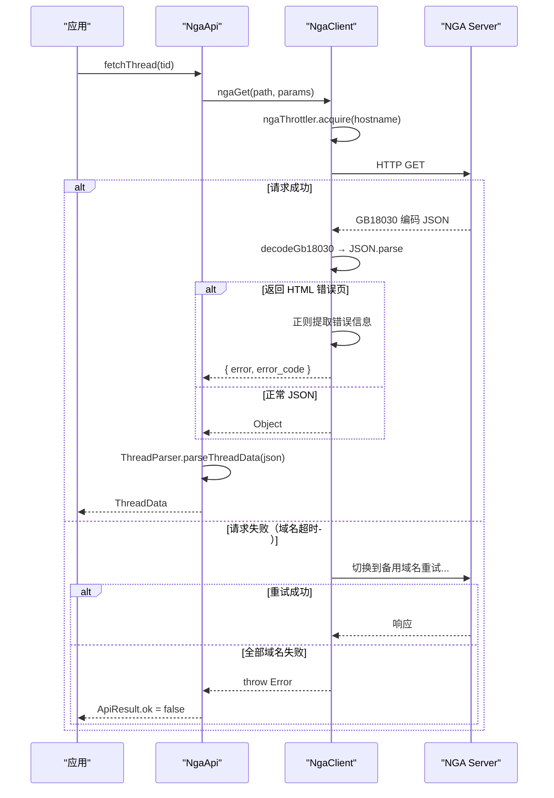

# API 通信

## 概述

API 通信层分为两层架构：`NgaClient` 负责 HTTP 传输与编码解码，`NgaApi` 封装具体业务接口。这种设计将传输容错逻辑集中一处，避免各业务接口重复实现。

`service/` 目录的文件结构：



## NgaClient 传输层

### 核心请求流程

`NgaClient.ets:383-499`（`ngaRequest` 函数）：

```typescript
// NgaClient.ets:383-499 — 核心请求流程
async function ngaRequest(path, method, params, body, cookies, baseUrl, extraHeaders, skipInchst) {
  // 1. 域名解析与限流获取
  await ngaThrottler.acquire(hostname)

  // 2. 构建 URL 与请求头
  const url = buildUrl(resolvedBaseUrl, path, params)
  // User-Agent: NGA_WP_JW, X-User-Agent: Nga_Official

  // 3. 发送 HTTP 请求
  response = await httpReq(url, method, header, body)

  // 4. 失败时遍历备用域名重试
  // ...

  // 5. GB18030 解码 → JSON 解析
  const rawText = decodeGb18030(response.body)
  return JSON.parse(text)
}
```

### 请求方法封装

| 方法 | 函数名 | 说明 |
|------|--------|------|
| GET | `ngaGet` | 标准 GET 请求（`NgaClient.ets:274`） |
| POST | `ngaPost` | 表单编码 POST（`NgaClient.ets:279`） |
| POST with query | `ngaPostWithQuery` | POST + URL 参数（`NgaClient.ets:286`） |
| Multipart | `ngaPostMultipart` | 文件上传（`NgaClient.ets:296`） |
| Raw | `ngaGetRaw` | 返回 ArrayBuffer（`NgaClient.ets:305`） |
| HTML | `ngaGetHtmlText` | 返回 HTML 文本（`NgaClient.ets:311`） |

### 域名故障转移

当首选域名请求失败时，依次尝试配置中的所有备用域名（`NgaClient.ets:339-355`）：

```typescript
// NgaClient.ets:339-355 — 遍历备用域名重试
for (let i = 1; i < DOMAINS.length; i++) {
  const retryDomainIdx = (activeDomainIndex + i) % DOMAINS.length
  const retryBaseUrl = baseUrl || DOMAINS[retryDomainIdx]
  // 切换到备用域名重试...
}
```

### 错误检测与降级

`NgaClient.ets:464-480` 处理服务器返回的 HTML 错误页面：

```typescript
// 检测 HTML 错误标记
if (trimmed.startsWith('<!DOCTYPE') || trimmed.startsWith('<html')) {
  // 提取 <!--msginfostart--> 中的错误描述
  // 提取 <!--msgcodestart--> 中的错误码
  return { error: ..., error_code: ... }
}
```

### 限流控制

| 参数 | 值 |
|------|-----|
| 连接超时 | `15000 ms` |
| 读取超时 | `30000 ms` |
| 限流器 | `ngaThrottler`（`Throttle.ets`） |

## NgaApi 公共 API

### 返回类型

所有 API 返回类型显式定义为 Class（`NgaApi.ets:31-103`）：

| 返回类 | 继承 | 字段 |
|--------|------|------|
| `ApiResult` | — | `ok`, `error` |
| `VoteResult` | ApiResult | `message` |
| `CaptchaResult` | ApiResult | `image` |
| `LoginStep1Result` | ApiResult | `needCaptcha`, `loginToken`, `captchaId`, `captchaImage` |
| `LoginStep2Result` | ApiResult | 同上 + `token`, `user` |
| `PostAuthResult` | ApiResult | `canReply` |

### 业务接口

| 接口函数 | 文件行号 | 说明 |
|----------|----------|------|
| `verifyToken` | `NgaApi.ets` | Token 有效性验证 |
| `fetchCategories` | `NgaApi.ets` | 论坛板块分类 |
| `fetchTopicList` | `NgaApi.ets` | 主题列表 |
| `fetchThread` | `NgaApi.ets` | 帖子详情（含所有楼层） |
| `fetchMorePosts` | `NgaApi.ets` | 分页加载更多楼层 |
| `searchTopics` | `NgaApi.ets` | 搜索主题 |
| `sendReply` | `NgaApi.ets` | 发送回复 |
| `postThread` | `NgaApi.ets` | 发新帖 |
| `uploadImage` | `NgaApi.ets` | 上传图片 |
| `loginStep1/2` | `NgaApi.ets` | 两步登录 |

## 请求时序



## 并发解析

`NgaApi.ets` 利用 `taskpool` 在后台线程执行 HTML 解析（`HtmlParseTask.ets:3-6`）：

```typescript
// HtmlParseTask.ets:3-6 — @Concurrent 后台解析
@Concurrent
function parseHtmlTask(html: string): Object {
  return parseHtmlToRawJson(html) as Object
}
```

## 数据模型

| 模型 | 文件 | 核心字段 |
|------|------|----------|
| `ApiResult` | `NgaApi.ets:31` | ok, error |
| `PostInfo` | `NgaApi.ets:74` | tid, pid, lou, author, content, attachs |
| `ThreadData` | `NgaApi.ets:122` | threadInfo, forumName, pagination, posts |
| `ThreadPagination` | `NgaApi.ets:115` | currentPage, totalPages |
| `TopicListInfo` | `model/Topic.ets` | threads, totalPages, forumName |
| `Category` | `model/Forum.ets` | fid, name, children |

## 边缘情况

1. **非标准 JSON**：NGA 接口 JSON 前可能附加非 JSON 字符，`preprocessJson` 负责清理
2. **HTML 错误页**：某些错误码下服务器直接返回 HTML 而非 JSON，需正则提取错误信息
3. **GB18030 编码**：服务端使用 GB18030，所有响应文本需要解码后才能 JSON.parse
4. **空响应**：部分接口成功返回空对象，需防御性处理

## 常见问题

**Q: 请求返回 `ApiResult.ok = false`，但 status code 是 200？**
A: 这是 NGA 业务层错误，错误描述在 `ApiResult.error` 字段中。常见原因：token 过期、权限不足、发帖间隔过短。

**Q: 如何排查 HTTP 请求失败？**
A: 查看日志中 `[NGA][REQ]` tag，确认请求 URL、方法和 body。`[NGA][RES]` 可见响应状态码。如果出现 `<!DOCTYPE` 前缀，说明服务器返回了 HTML 错误页。

**Q: 为什么有时请求很慢？**
A: `ngaThrottler` 限制了每个域名的并发数。多个并发请求会排队等待。另外域名故障转移机制会遍历所有备用域名，全部超时后会返回最后一次的错误。
