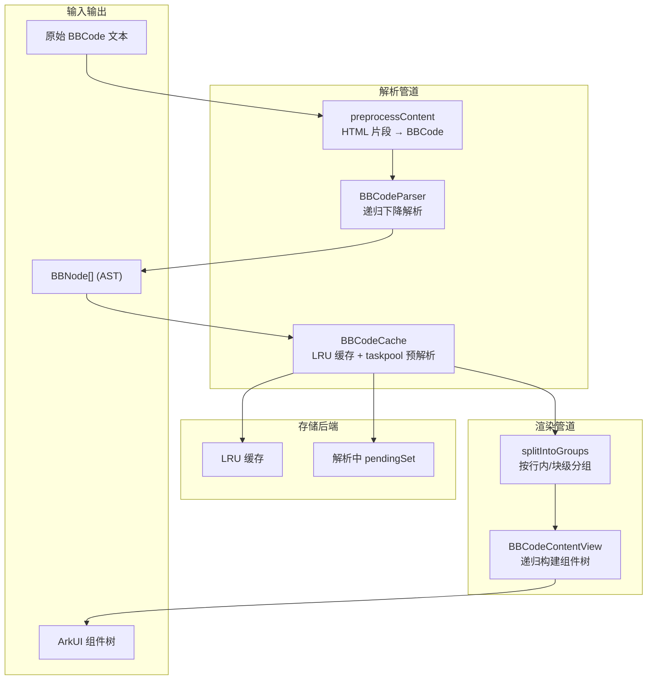
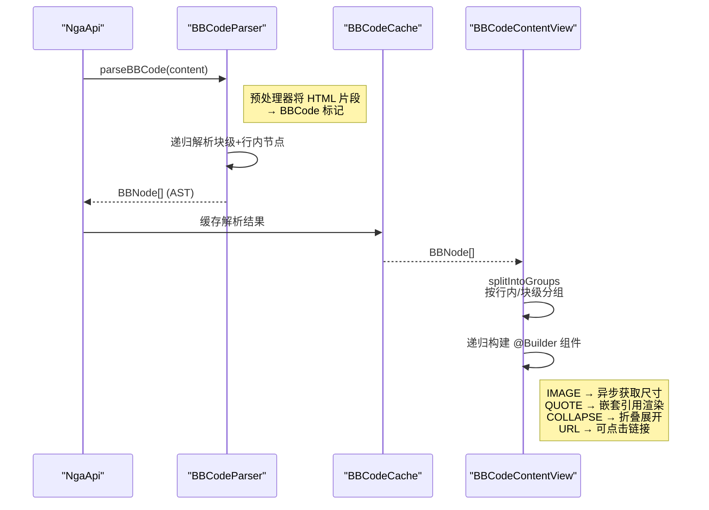

# BBCode 解析与渲染

## 概述

NGA 帖子内容使用 BBCode 标记语言。解析渲染管道由 `service/BBCodeParser.ets` → `service/BBCodeCache.ets` → `common/BBCodeContentView.ets` 三部分组成，将原始 BBCode 文本转换为 ArkUI 组件树。

## 整体流程





## 数据模型

`model/BBCodeNode.ets:1-59` 定义了统一的 AST 节点结构：

```typescript
// BBCodeNode.ets — 39 种节点类型
export enum BBNodeType {
  TEXT, BOLD, ITALIC, UNDERLINE, STRIKETHROUGH,
  COLOR, SIZE, FONT, URL, IMAGE, QUOTE, COLLAPSE,
  CODE, LIST, LIST_ITEM, PID_LINK, UID_LINK, TID_LINK,
  MENTION, POST_BY, EMOTION, VIDEO, AUDIO, DICE,
  WARN, ALBUM, TABLE, TABLE_ROW, TABLE_CELL,
  // ...
}

export class BBNode {
  type: BBNodeType = BBNodeType.TEXT
  text: string = ''
  children: BBNode[] = []
  href: string = ''       // URL 链接
  src: string = ''         // IMAGE/VIDEO 源地址
  color: string = ''       // 文字颜色
  size: number = 0         // 字号
}
```

## BBCodeParser 解析器

`service/BBCodeParser.ets` 实现递归下降解析：

### 预处理阶段

`preprocessContent`（`BBCodeParser.ets:111-127`）在解析前将 HTML 片段转换为 BBCode：

```typescript
// BBCodeParser.ets:112-118 — 预处理
return s
  .replace(/&#91;/g, '[').replace(/&#93;/g, ']')
  .replace(/<blockquote[^>]*>/gi, '[quote]')
  .replace(/<a\s+href="(https?:\/\/[^"]+)"[^>]*>(.*?)<\/a>/gi, '[url=$1]$2[/url]')
  .replace(/]+class="nga-emotion"[^>]+alt="([a-z]+):([^"]+)"\s*\/?>/gi, '[s:$1:$2]')
```

### 解析策略

- **块级解析**（`parseBlockNodes`, `BBCodeParser.ets:138-200`）：识别 `[quote]`、`[code]`、`[list]` 等块级标签，递归处理嵌套
- **行内解析**（`parseInlineInto`）：处理加粗、颜色、链接等行内标签
- **配合 `closePattern` 正则**：块级解析接受关闭模式，遇到关闭标签时返回当前层级结果

## BBCodeCache 缓存

`service/BBCodeCache.ets` 缓存解析后的 AST 避免重复解析：

- Key: 帖子内容 hash + 附加参数
- 适用于相同内容在帖子预览和详情中分别展示的场景

## BBCodeContentView 渲染

`common/BBCodeContentView.ets` 将 AST 转换为 UI 组件树：

### 性能优化 — 节点分组

`BBCodeContentView.ets:278-301` — 连续的行内节点合并为一个组进行批量渲染：

```typescript
// BBCodeContentView.ets:278-300 — 行内节点分组
private splitIntoGroups(nodes: BBNode[]): NodeGroup[] {
  while (i < nodes.length && isInlineNode(nodes[i].type)) {
    inlineNodes.push(nodes[i])  // 合并连续行内节点
    i++
  }
  // 块级节点独立成组
}
```

### 各标签渲染策略

| 节点类型 | 渲染方式 | 说明 |
|----------|----------|------|
| `TEXT` | `Text()` | 基本文本节点 |
| `BOLD` | `Text().fontWeight(Bold)` | 粗体 |
| `URL` | `Text().onClick(href)` | 可点击链接，蓝色主题色 |
| `IMAGE` | `Image()` | 异步加载，支持尺寸获取 |
| `QUOTE` | `Column() + border(left)` | 左侧竖线边框，支持嵌套 |
| `COLLAPSE` | `Column() + onClick` | 点击展开/折叠，记录已展开 keys |
| `CODE` | `Column() + 灰色背景` | 代码块 |
| `EMOTION` | `Image()` | NGA 表情，通过 emotion tag 解析 |
| `LIST` | `Column() + ForEach` | 有序/无序列表 |
| `TABLE` | `Grid()/Flex` | 表格，支持 colSpan/rowSpan |
| `AUDIO` | `AudioPlayer` | 内嵌音频播放器组件 |
| `VIDEO` | `Image(封面) + onClick` | 视频预览 + 点击播放 |

### 引用（QUOTE）嵌套

```typescript
// BBCodeContentView.ets:65-75 — QUOTE 节点处理
function splitQuoteChildren(children: BBNode[]): QuoteSplit {
  // 第一个子节点为 POST_BY 时视为引用头（"Post by xxx"）
  if (children[0].type === BBNodeType.POST_BY) {
    result.hasHeader = true
    // body 为后续内容
  }
}
```

引用边框颜色通过 `AppColors.quoteBorders`（3 种颜色循环）标识嵌套层级。

## 错误处理

### 解析失败降级

`BBCodeParser.ets:130` 的入口函数 `parseBBCode` 在收到空内容时直接返回空数组，不抛出异常。整个解析过程**无 try-catch**，依赖防御式边界检查：

- 空输入保护（`BBCodeParser.ets:130`）：`null`/`undefined`/空字符串 → 返回 `[]`
- 空文本跳过（`BBCodeParser.ets:102-108`）：纯换行符内容不会产生空文本节点
- 标签未闭合回退（`BBCodeParser.ets:314-317` 等 5 处）：找不到闭合标签时取到字符串末尾，避免死循环

### 不安全 URL 拦截

`BBCodeParser.ets:75-85` 的 `isSafeUrl` 白名单校验拦截 `javascript:`、`vbscript:`、`data:` 三种危险协议。拦截的 URL 赋为空字符串而非抛出异常。

### 缓存异常保护

`BBCodeCache.ets:81-86` 中 `group.addTask()` 失败时仅记录错误，不阻塞其他任务的添加。`taskpool.execute()` 超时或失败时（`BBCodeCache.ets:88-99`）清理 pendingSet 防止内存泄漏。

**已知薄弱点**：`BBCodeCache.ets:12` 的 `bbNodesFromJSON` 中 `JSON.parse` 无 try-catch 保护，taskpool 返回异常 JSON 时将抛出未捕获异常。

### 渲染容错

- **图片尺寸获取失败**：`ImageSizeUtil` 超时或返回非图片内容时使用默认比例（16:9）渲染占位，不破坏页面布局
- **嵌套过深**：多层 QUOTE（10+ 层）导致组件树膨胀时，`splitIntoGroups` 的行内合并可部分缓解，极端情况需配合 `LazyForEach` 选择性渲染
- **音频播放错误**：`AudioPlayer.ets:110-113` 的 error 回调置 `hasError` 为 true，UI 切换为「加载失败」状态

## 关联组件

| 组件 | 文件 | 说明 |
|------|------|------|
| `AudioPlayer` | `common/AudioPlayer.ets` | BBCode AUDIO 标签的播放器组件 |
| `ImageSizeUtil` | `common/ImageSizeUtil.ets` | 图片尺寸预获取 |
| `VideoSizeUtil` | `common/VideoSizeUtil.ets` | 视频尺寸预获取 |
| `EmotionResources` | `common/EmotionResources.ets` | NGA 表情映射 |
| `LinkUtils` | `common/LinkUtils.ets` | URL 链接处理 |

## 边缘情况

1. **嵌套过深**：多层 QUOTE/Collapse 嵌套可能导致递归层级过深，影响渲染性能
2. **HTML 混合内容**：部分帖子内容混入 HTML 片段，需要预处理
3. **表情 URL 格式变化**：NGA 表情图片 URL 格式可能变化，emotion 正则需同步维护
4. **恶意标签**：PidLink/UidLink/TidLink 可能指向恶意内容，需配合 LinkUtils 安全检查

## 常见问题

**Q: 帖子内容部分 BBCode 标签没有正确渲染？**
A: 检查 `BBNodeType` 枚举是否覆盖了该标签类型，以及 `BBCodeContentView` 中是否有对应的渲染 Builder。部分 NGA 特有标签（如 `[dice]`、`[warn]`）尚未实现对应 UI。

**Q: BBCode 渲染性能差怎么办？**
A: 大段文本（数千行）或极深嵌套的 QUOTE（10+ 层）会导致组件树膨胀。`splitIntoGroups` 的行内合并可以缓解，但极端情况建议开启 `LazyForEach` 选择性渲染。

**Q: 图片尺寸获取失败，布局偏移怎么办？**
A: `ImageSizeUtil` 获取失败时使用默认比例（16:9），页面布局不会完全错乱。可在设置中开启/关闭预热图片尺寸来平衡精度与耗时。
