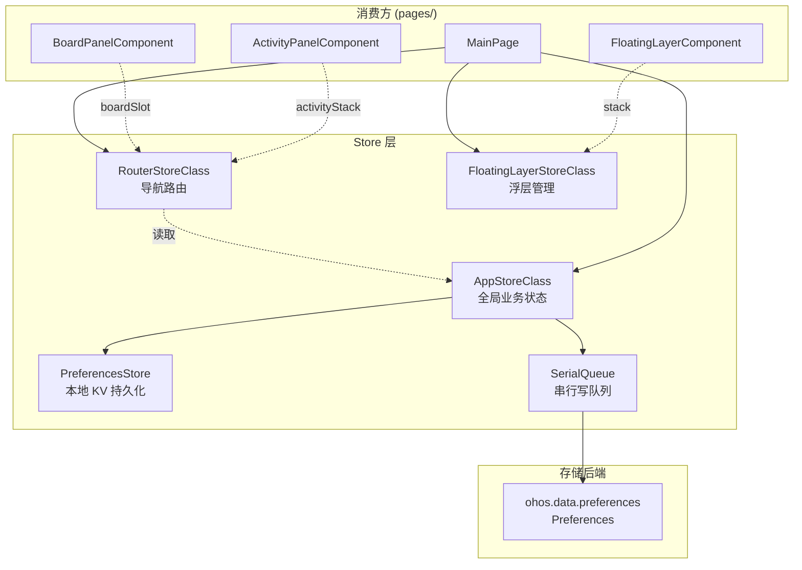
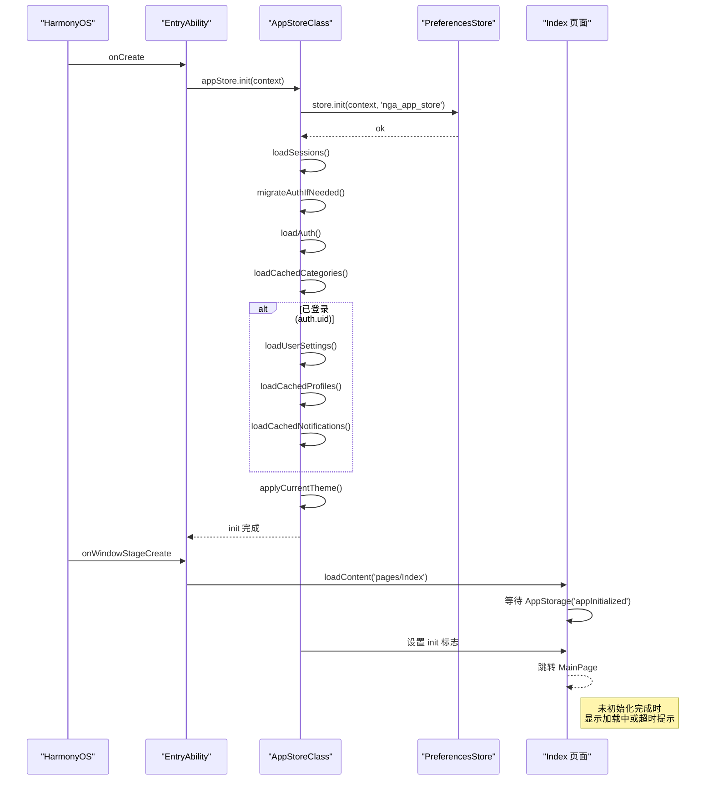

# Store 架构

## 概述

状态管理层采用 `@Observed` 装饰的全局单例 Class 模式，结合 `AppStorage` 跨页面共享标量状态。所有 Store 文件位于 `store/` 目录下。



### 初始化时序



## 各 Store 职责

| Store | 类名 | 文件 | 核心职责 |
|-------|------|------|----------|
| 全局业务 | AppStoreClass | `AppStore.ets:115` | 认证、设置、分类、缓存、通知、Session |
| 导航路由 | RouterStoreClass | `RouterStore.ets:205` | 板块导航、活动栈管理、返回处理 |
| 浮层管理 | FloatingLayerStoreClass | `FloatingLayerStore.ets:10` | 图片查看、资料卡、回复框、确认框 |
| 本地持久化 | PreferencesStore | `PreferencesStore.ets` | 异步 KV 读写、批量 flush |

## AppStore 详解

### Auth 认证管理

`AppStore.ets:182-256` 处理认证生命周期：

```typescript
// AppStore.ets:184-200 — 设置认证（uid 变更时重置用户状态）
async setAuth(token: string, uid: string, nickName: string, avatarUrl: string): Promise<void> {
  this.auth.token = token
  this.auth.uid = uid
  this.auth.isAuthenticated = true
  this.persistAuth()
  if (uidChanged) {
    this.resetUserState()
    await this.loadUserSettings()
    await this.loadCachedProfiles()
    await this.loadCachedNotifications()
    this.applyCurrentTheme()
  }
}
```

**数据留痕**：认证信息通过 `SerialQueue` 串行写入 Preferences，包括旧格式兼容迁移（`migrateAuthIfNeeded`, `AppStore.ets:237-256`）。

### Settings 设置管理

管理的设置项包括：

| 设置项 | 类型 | 说明 |
|--------|------|------|
| 黑名单 | `BlacklistEntry[]` | 屏蔽用户列表 |
| 用户笔记 | `UserNoteEntry[]` | 自定义用户备注 |
| 关键词过滤 | `FilterKeyword[]` | 帖子内容过滤 |
| Favorites | `number[]` | 收藏板块列表 |

设置变更通过 `persistSettings()` 异步写入 Preferences。

### 缓存管理

| 缓存 | 容量 | TTL | 说明 |
|------|------|-----|------|
| 用户资料 | 200 条 | 5 分钟 | `LruCache<ProfileData>` |
| Session | 动态 | 无 | `Map<string, Session>` |
| 分类列表 | 1 份 | 手动刷新 | `cachedCategories` |
| 通知缓存 | 动态 | 30s 防抖 | `lastNotiQueryTime` 控制 |

### 初始化流程

`AppStore.ets:162-180` 的 `init` 方法在 `EntryAbility.onCreate` 中异步调用：

```typescript
// AppStore.ets:162-180 — 初始化顺序
async init(context: Context): Promise<void> {
  await this.store.init(context, 'nga_app_store')
  await this.loadSessions()
  await this.migrateAuthIfNeeded()   // 旧 Token 格式迁移
  await this.loadAuth()              // 读取认证
  await this.loadCachedCategories()  // 加载板块分类缓存
  if (this.auth.uid) {
    await this.loadUserSettings()    // 用户个性化设置
    await this.loadCachedProfiles()  // 用户资料缓存
    await this.loadCachedNotifications()
  }
  this.applyCurrentTheme()           // 应用主题
}
```

## RouterStore 导航路由

`RouterStore.ets:205-274` 管理两级导航模型：

- **板块导航**: `boardSlot` 表示当前选中的论坛板块
- **活动导航**: `activityStack` (NavEntry[]) 表示浏览栈（帖子详情、搜索等）

```typescript
// RouterStore.ets:236-255 — navigateActivity 自动去重逻辑
navigateActivity(screen: Screen, replace: boolean = false): void {
  if (replace && this.activityStack.length > 0) {
    // 替换栈顶
  } else if (screen.type === 'thread') {
    // 连续 thread 类型替换（避免帖-帖-帖堆叠）
    if (top && top.screen.type === 'thread') {
      next[next.length - 1] = entry
    } else {
      this.activityStack = [...this.activityStack, entry]
    }
  } else {
    this.activityStack = [...this.activityStack, entry]
  }
}
```

**返回键处理优先级**（`MainPage.ets:51-73`）：浮层关闭 → 活动栈回退 → 板块回退。

## FloatingLayerStore 浮层管理

`FloatingLayerStore.ets:10-111` 维护浮层堆栈，支持页面去重（已存在的页面移动到栈顶）。

| 浮层类型 | 枚举值 | 附带数据 |
|----------|--------|----------|
| 图片查看器 | `IMAGE_VIEWER` | `imageViewerUrls[]`, `imageViewerIndex` |
| 用户资料卡 | `PROFILE_CARD` | `profileCardUid`, `profileCardX/Y` |
| 回复弹窗 | `REPLY_DIALOG` | `replyOnSend`, `editMode`, `editInitialContent` |
| 确认弹窗 | `CONFIRM_DIALOG` | `confirmTitle`, `confirmMessage`, `confirmOnConfirm` |

## 持久化层

`PreferencesStore` 基于 `ohos.data.preferences` 实现异步 KV 存储：

| 方法 | 说明 |
|------|------|
| `putJSON(key, value, immediate)` | 序列化写入 |
| `getJSON<T>(key)` | 读取反序列化 |
| `putString/getString` | 字符串存取 |
| `scheduleFlush()` | 延迟批量刷盘 |
| `flush()` | 立即刷盘 |

写操作通过 `SerialQueue` 串行化执行，避免并发竞态。

## 并发保障

- **SerialQueue**（`store/SerialQueue.ets`）：FIFO 队列，异步任务依次执行
- **flushAll**：应用 `onBackground` 时（`AppStore.ets:101`）触发全量持久化，防止被系统杀死后丢失数据

## 错误处理

### 存储写入失败

`PreferencesStore` 的写入操作通过 `SerialQueue` 串行化，单次写入失败不会阻塞后续操作。`scheduleFlush` 会延迟批量刷盘，减少高频写入时的失败概率。

### 认证恢复失败

`AppStore.ets:225-235` 的 `loadAuth` 方法在读取本地认证失败时返回空值，`auth.isAuthenticated` 被置为 `false`，应用会自动跳转登录页。

### 数据不一致

当 uid 变更时（`AppStore.ets:193-199`），`setAuth` 会调用 `resetUserState` 清除旧用户数据，再重新加载新用户的设置和缓存，避免跨用户数据污染。

## 常见问题

**Q: 修改了 Store 中的字段，UI 没有更新？**
A: 确认目标字段是否在 `@Observed` 类的直接属性上。嵌套对象或数组需要使用不可变替换（`this.list = [...this.list, item]`）而非 `push`，才能触发监测。

**Q: AppStore init 失败怎么办？**
A: `AppStore.ets:162-180` 中 init 的 catch 分支仅 `hilog.error` 不会影响应用启动。`AuthState.initialized` 在此状态下仍可能为 false，`Index` 页面需做等待超时处理。

**Q: 应用切后台再切回来后状态丢失？**
A: 检查 `onBackground` 是否触发了 `flushAll()`。如果闪退前未持久化，重启时从 Preferences 恢复上一个有效状态。
