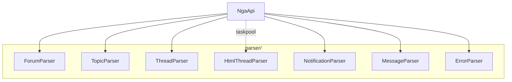
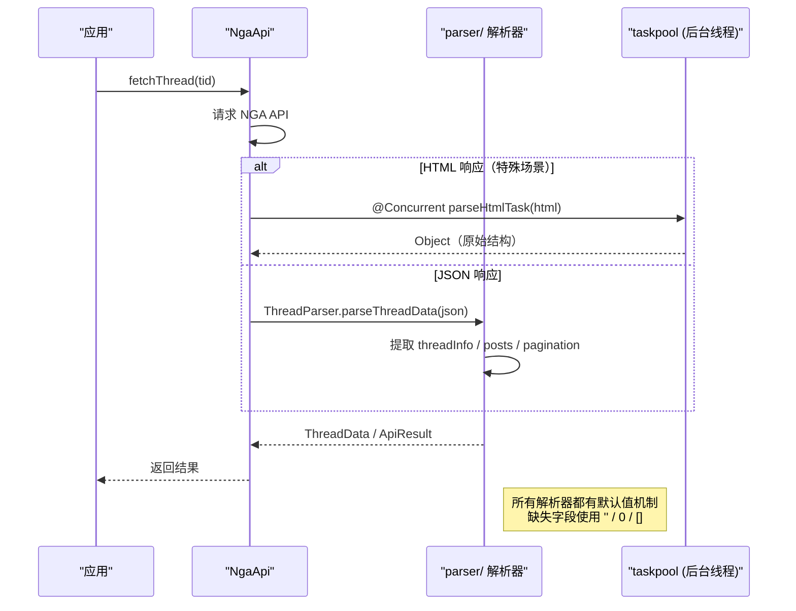

# 数据解析器

## 概述

`parser/` 目录负责将 NGA 接口返回的 JSON/HTML 数据转换为客户端模型对象。解析器在 `NgaApi` 中调用，通过 taskpool 支持后台并发解析。
 


### 调用时序



## 各解析器职责

| 解析器 | 文件 | 输入 | 输出 |
|--------|------|------|------|
| `ForumParser` | `ForumParser.ets` | JSON | `Category[]` |
| `TopicParser` | `TopicParser.ets` | JSON | `TopicListInfo` |
| `ThreadParser` | `ThreadParser.ets` | JSON | `ThreadData` |
| `HtmlThreadParser` | `HtmlThreadParser.ets` | HTML | `Object`（原始 JSON 结构）|
| `NotificationParser` | `NotificationParser.ets` | JSON | `NgaNotification[]` |
| `MessageParser` | `MessageParser.ets` | JSON | `MessageListInfo`, `MessageDetailInfo` |
| `ErrorParser` | `ErrorParser.ets` | JSON | `ApiResult`（错误消息提取）|
| `AnonymousParser` | `AnonymousParser.ets` | JSON | 匿名标识转换 |
| `ClientParser` | `ClientParser.ets` | JSON | 客户端设备信息 |
| `JsonUtil` | `JsonUtil.ets` | 原始 JSON | 安全的 JSON 解析 |

### ForumParser — 板块分类解析

解析 NGA 板块层级结构为 `Category[]`，支持父子嵌套：

```typescript
// ForumParser.ets — 输入 → Category[] 
// Category: { fid: number, name: string, children: Category[] }
```

### HtmlThreadParser — HTML 帖子解析

`HtmlThreadParser.ets:545` 是整个项目中唯一使用 `@Concurrent` 的解析器，在 taskpool 后台线程执行：

```typescript
// HtmlParseTask.ets:3-6 — 后台并发解析入口
@Concurrent
function parseHtmlTask(html: string): Object {
  return parseHtmlToRawJson(html) as Object
}
```

HTML 解析流程：

1. 使用正则从 HTML 中提取每个楼层的 fid、作者、内容、时间
2. 解析 `<!--msginfostart-->` 错误标记
3. 将提取的信息组装为类 JSON 的 Object 结构

## 解析错误处理

`ErrorParser.ets` 从 API 响应中提取错误消息：

```typescript
// ErrorParser.ets — 从 JSON 中提取 '0' 字段作为错误描述
// 兼容 NGA 返回格式：{ "0": "错误描述" }
```

## 调用流程

以加载帖子详情为例（`NgaApi.ets`）：

1. `NgaApi.fetchThread(tid)` 调用 `NgaClient.ngaGet`
2. 返回的 JSON 传递给 `ThreadParser.parseThreadData(json)`
3. `ThreadParser` 提取 `threadInfo`、`forumName`、`pagination`、`posts`
4. 对每 `PostInfo` 的 `content` 字段再通过 `BBCodeParser` 解析为 `BBNode[]`
5. 返回 `ThreadData` 对象

## 边缘情况

1. **不完整 JSON**：NGA 接口有时返回空对象或缺少关键字段，解析器需防御性默认值
2. **多重嵌套**：回复列表的 comments 字段可能形成深层嵌套，有限递归防止栈溢出
3. **空列表**：通知/私信为空时，解析器应返回空数组而非异常
4. **特殊 HTML 实体**：`&#91;`、`&#93;` 等转义在解析后需转换回原始字符
5. **编码不匹配**：JSON 解析前内容已统一为 UTF-8，HTML 解析需单独处理 GB18030 混合编码

## 常见问题

**Q: 解析结果数据不符合预期（字段缺失/类型不符）？**
A: NGA 接口的某些字段在特定场景下会缺失（如匿名帖子无 authorid）。解析器的默认值机制（所有 field 初始化 = 0 / ''）可以保证解析不崩溃，但业务层需做空值判断。

**Q: 解析性能瓶颈在哪里？**
A: HTML 解析（`HtmlThreadParser`）是唯一在 taskpool 中执行的。JSON 解析在主线程，由于数据量不大（单个帖子 JSON 一般在几百 KB 内），不会造成明显卡顿。

**Q: 新增一个 API 接口后，解析步骤走哪一条路？**
A: 如果接口返回 JSON → 在 `parser/` 下新增对应解析器，或复用已有解析器。如果接口返回 HTML → 通过 `ngaGetHtmlText` 获取文本 → 使用 `HtmlThreadParser` 或新增解析器。解析结果在 `NgaApi` 中封装为显式 Class 返回。
