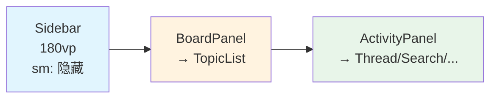
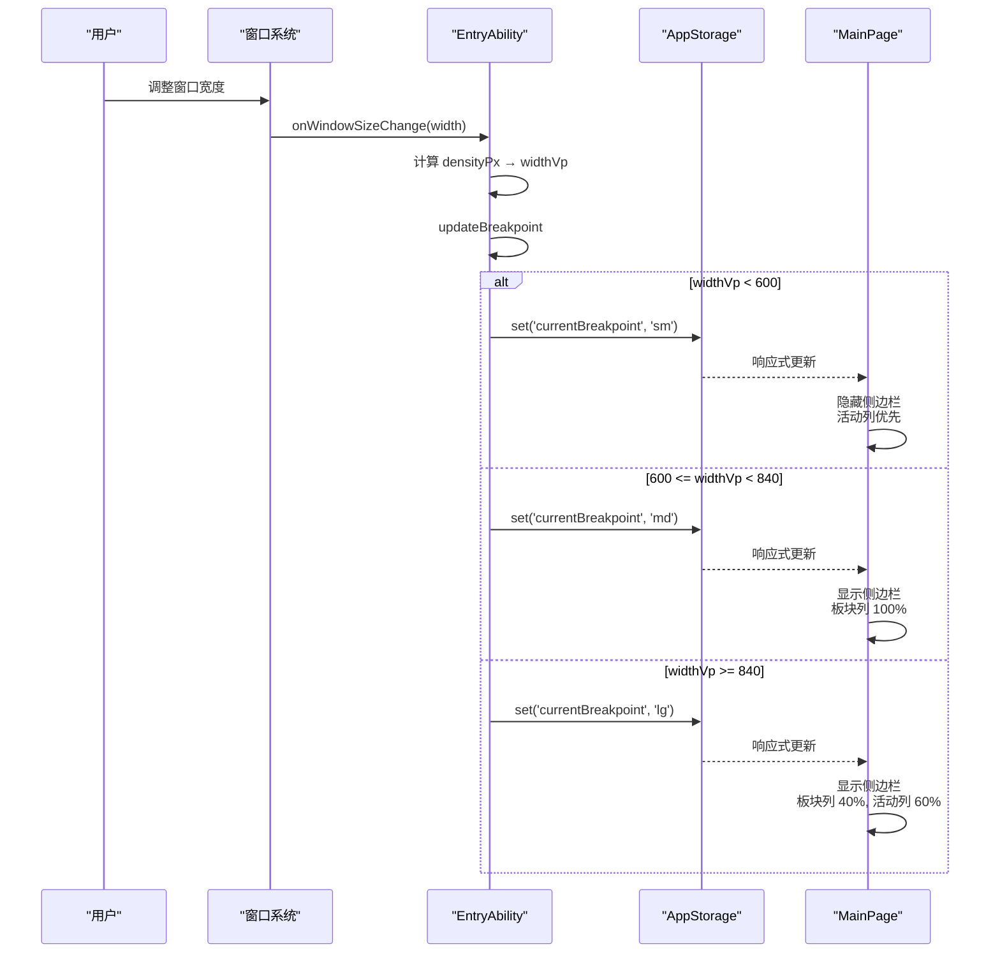

# 主页面与响应式布局

## 概述

`MainPage`（`pages/MainPage.ets`）是应用的核心主页面，采用三列 Panel 架构，通过单一布局结构配合 `.visibility()` 控制显隐，避免断点切换时组件重建导致 `@State` 丢失。

`pages/` 目录结构：

| 文件 | 职责 |
|------|------|
| `MainPage.ets` | 主页面三列布局容器 |
| `Index.ets` | 启动页，等待 AppStore 初始化后跳转 |
| `SidebarComponent.ets` | 侧边栏（社区/我的 Tab 切换） |
| `BoardPanelComponent.ets` | 板块面板转发容器 |
| `CommunityTabContent.ets` | 社区网格（sm 模式） |
| `ActivityPanelComponent.ets` | 活动面板容器栈 |
| `FloatingLayerComponent.ets` | 浮层渲染容器 |

## 三列布局



### 断点策略

`EntryAbility.ets:105-126` 根据窗口宽度计算断点：

| 断点 | 窗口宽度 (vp) | 列数 | 侧边栏 | 板块列 | 活动列 |
|------|---------------|------|--------|--------|--------|
| sm | < 600 | 1 | 隐藏 | 内容区（activity 优先） | — |
| md | 600 ~ 840 | 2 | 显示 | 内容区（activity 优先） | — |
| lg | >= 840 | 3 | 显示 | 40% 宽 | 60% 宽 |

```typescript
// EntryAbility.ets:112-120 — 断点判定逻辑
let newBp: string = 'sm'
if (widthVp < 600) {
  newBp = 'sm'
} else if (widthVp < 840) {
  newBp = 'md'
} else {
  newBp = 'lg'
}
AppStorage.setOrCreate('currentBreakpoint', newBp)
```

### 布局容器代码

`MainPage.ets:76-123` 的核心构建方法：

```typescript
// MainPage.ets:76-122 — 三列容器
build() {
  Stack() {
    Row() {
      SidebarComponent()              // 第一列：固定 180vp
        .visibility(sm ? None : Visible)

      Row() {
        Column() { /* 板块列 */ }      // 第二列：sm 显示社区/板块
          .width(getBoardColWidth())   // lg: 40%, 其他: 100%
          .visibility(getBoardColVisibility())

        Column() { /* 活动列 */ }      // 第三列：帖子详情/搜索/设置等
          .layoutWeight(1)
          .visibility(activity? Visible : None)
      }
      .layoutWeight(1)
    }

    FloatingLayerComponent()           // 顶层：浮层覆盖
    ToastComponent()                   // 顶部：Toast 提示
  }
}
```

### 返回键处理

`MainPage.ets:51-73` 处理系统返回键，优先级依次为：

1. 浮层关闭（回复框 → 确认框 → 其他浮层）
2. 活动栈回退（`router.back()`）
3. 板块回退（sm 模式或搜索模式）
4. 默认返回 false（系统处理）

### 断点切换时序



## Index 启动页

`Index.ets` 作为应用入口页面，等待 `AppStore` 初始化完成后跳转主页面：

```typescript
// Index.ets — 等待 initialzed 标志
aboutToAppear(): void {
  // 监听 AppStorage('appInitialized')
  // 为 true 后跳转 MainPage
}
```

## 侧边栏 SidebarComponent

`pages/SidebarComponent.ets` 提供「社区」和「我的」两个 Tab：

- **社区 Tab**：板块分类列表、收藏、搜索入口
- **我的 Tab**：资料、私信、通知、设置、浏览历史

切换到不同 Tab 通过 `RouterStore.setSidebarTab()` 触发。

## 浮层系统 FloatingLayerComponent

`pages/FloatingLayerComponent.ets` 渲染顶层浮层内容，支持：

- 图片查看器（`IMAGE_VIEWER`）
- 用户资料卡（`PROFILE_CARD`）
- 回复弹窗（`REPLY_DIALOG`）
- 确认弹窗（`CONFIRM_DIALOG`）

浮层数据由 `FloatingLayerStore` 管理，支持堆叠、去重、关闭拦截。

## 错误处理

### 认证降级

`MainPage.ets:143-165` 在 `aboutToAppear` 时检查认证状态：

```typescript
// MainPage.ets:143-165 — 认证检查与降级
private async checkAuth(): Promise<void> {
  if (!appStore.auth.isAuthenticated) {
    // 未登录 → 跳转登录页
    this.getUIContext().getRouter().replaceUrl({ url: 'pages/LoginPage' })
    return
  }
  const valid = await verifyToken(appStore.auth.token)
  if (!valid) {
    appStore.clearAuth()
    // token 无效 → 清除认证 → 跳转登录页
    this.getUIContext().getRouter().replaceUrl({ url: 'pages/LoginPage' })
  }
}
```

### 布局避让区计算失败

`EntryAbility.ets:83-85` 中避让区计算如果抛出异常，不会影响页面加载，仅记录日志。此时 `statusBarHeight` 和 `navBarHeight` 保持默认值，页面可能出现轻微偏移。

## 常见问题

**Q: sm 模式下看不到侧边栏？**
A: 这是正常行为。sm 断点（< 600vp）隐藏侧边栏以最大化内容区域。切换到 md/lg 断点或旋转设备可恢复。

**Q: 断点切换时布局闪烁？**
A: `onWindowSizeChange` 在拖动窗口时会高频触发。`updateBreakpoint` 通过比较 `this.curBp !== newBp` 过滤不必要的更新，不会在每次拖动像素时都触发布局重排。

**Q: Index 页面卡住不跳转？**
A: `Index.ets` 等待 `AppStorage('appInitialized')` 标志。如果 `AppStore.init` 失败（日志 `AppStore init failed`），该标志不会被设置，`Index` 会一直停留在等待状态。当前无超时回退逻辑，需要重启应用。
